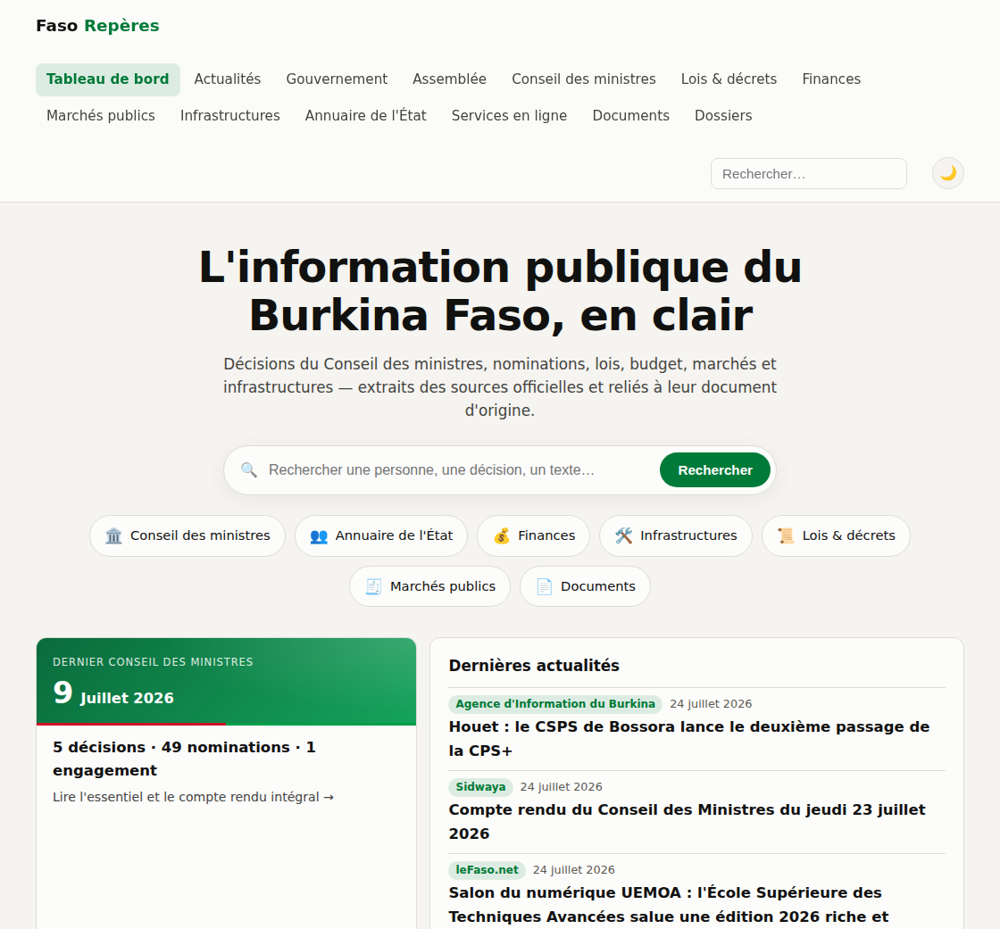
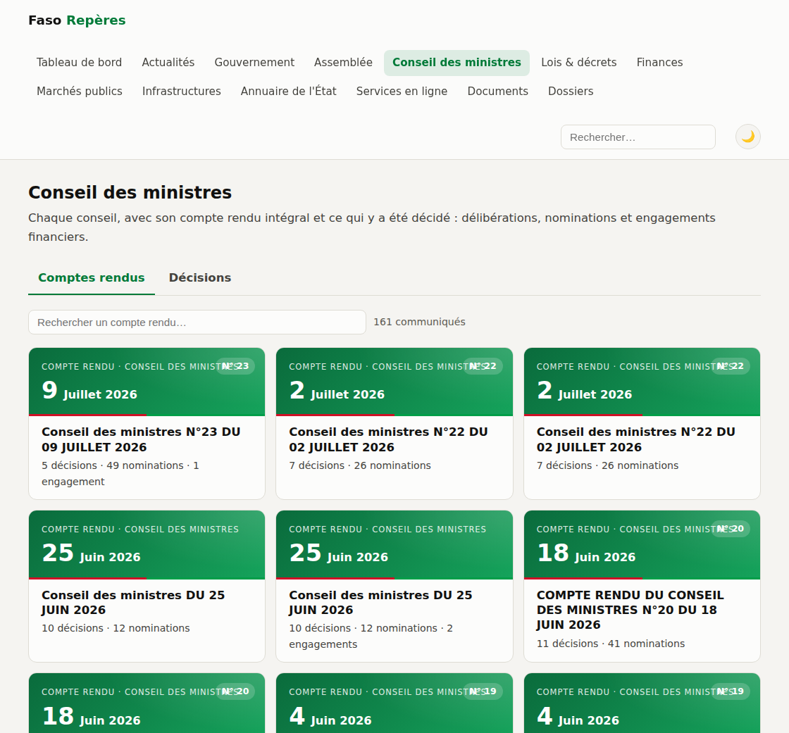
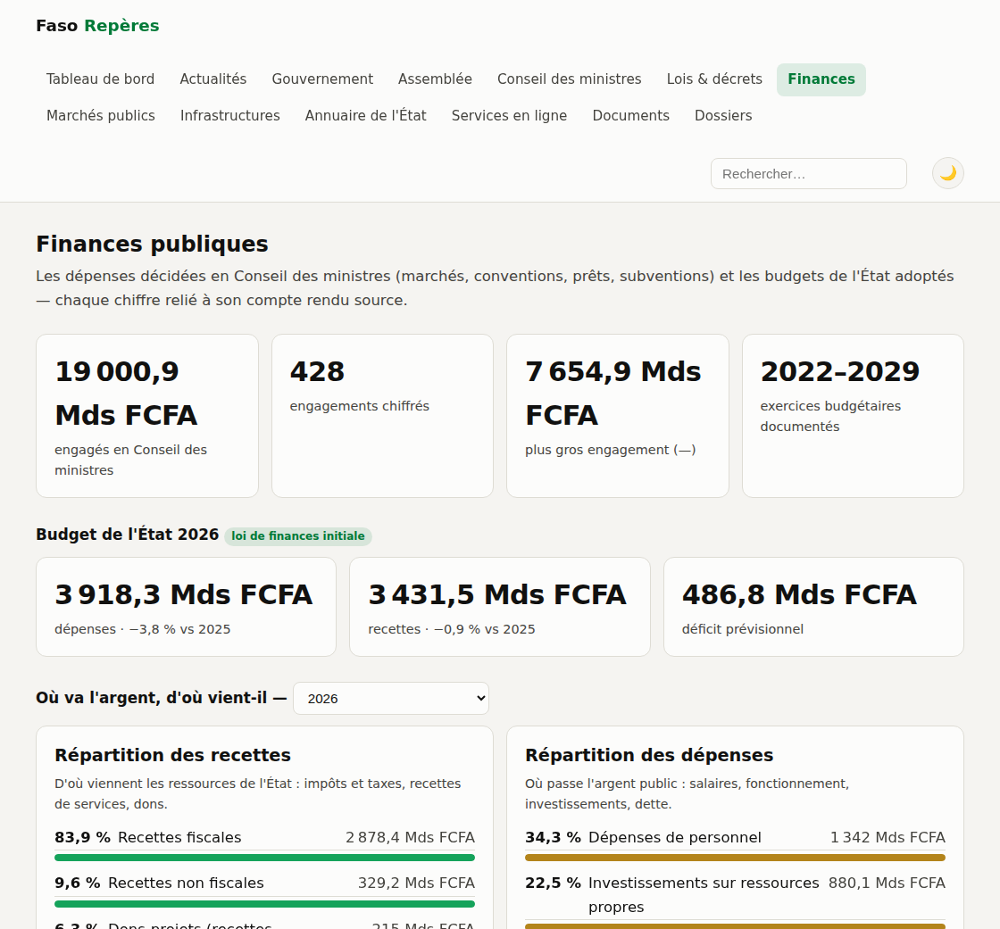
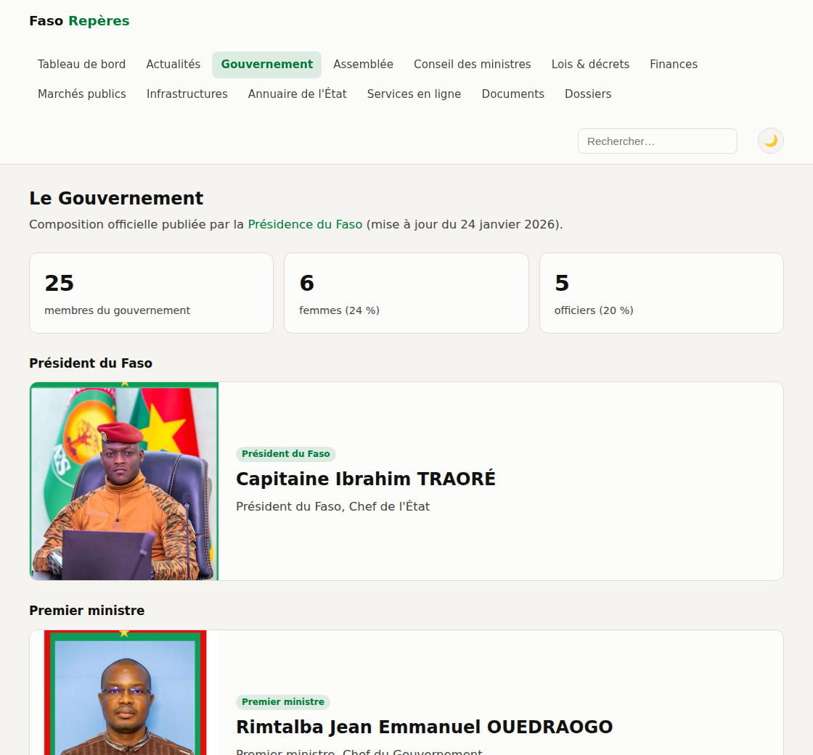
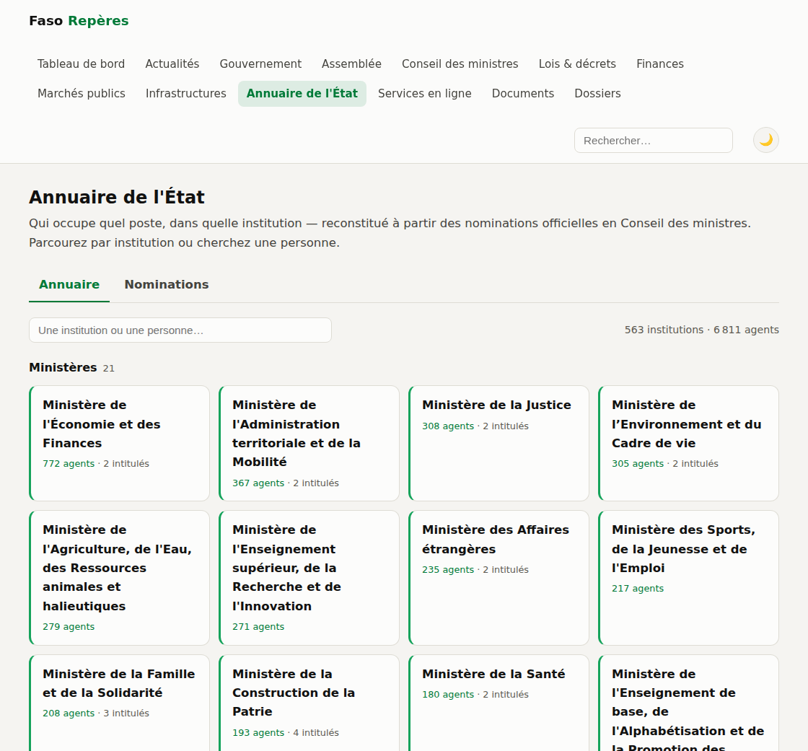
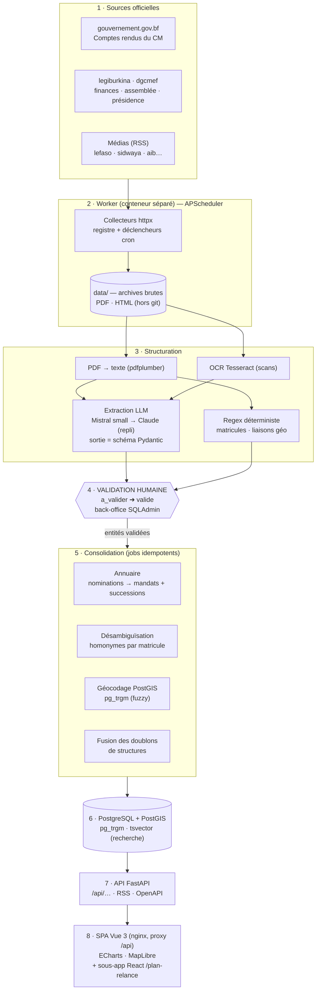

# Faso Repères — l'information publique du Burkina Faso

[](LICENSE)


Plateforme citoyenne indépendante qui **collecte, archive, structure et restitue
l'information publique burkinabè** : conseils des ministres, nominations, lois et
décrets, marchés publics, budget de l'État, composition du gouvernement et de
l'Assemblée. Chaque donnée affichée est reliée à son document source officiel.

Inspirée de [vie-publique.sn](https://www.vie-publique.sn) (Code for Senegal).

<table>
  <tr>
    <td></td>
    <td></td>
  </tr>
</table>

<p align="center"><em>Interface en thème clair et sombre.</em></p>

## Principes

1. **Sources officielles uniquement** — sites gouvernementaux (`.gov.bf`),
   Assemblée, Présidence, Légiburkina, et médias publics pour le fil d'actualités.
2. **Chaque chiffre est sourcé** — toute décision, nomination ou montant renvoie
   au compte rendu ou au texte officiel dont il est extrait.
3. **Rien n'est publié sans validation humaine** — l'extraction automatique
   (LLM) produit des entités `a_valider` ; seules les entités validées dans le
   back-office sortent sur l'API et le site.
4. **Le corpus est archivé en propre** — les sites officiels dépublient ;
   chaque document collecté (HTML, PDF) est conservé tel quel avant traitement.

## Ce que couvre la plateforme

| Section | Contenu |
|---|---|
| **Conseil des ministres** | 160 comptes rendus structurés (2022→) : résumé des décisions, texte intégral, PDF officiel |
| **Décisions** | 1 435 décisions validées, filtrables par ministère et nature |
| **Annuaire de l'État** | 563 institutions (ministères, présidence, justice, régions, police, diplomatie, établissements) ; 8 264 mandats reconstitués, fiches personnalités **désambiguïsées par matricule** (6 157 personnes) ; **titulaires en fonction distingués des anciens** par détection des successions |
| **Gouvernement** | Composition officielle avec portraits (Présidence du Faso), suivie à chaque remaniement |
| **Assemblée** | 71 députés synchronisés depuis an.bf, président de l'ALT, lois votées |
| **Lois & décrets** | ~4 900 textes juridiques (Légiburkina) avec PDF archivés et recherche plein texte (OCR) |
| **Marchés publics** | Attributions extraites des Quotidiens de la DGCMEF (attributaire, montant, objet, secteur) |
| **Finances** | Budget de l'État par exercice, répartition recettes/dépenses, allocations sectorielles, 428 engagements chiffrés du Conseil des ministres |
| **Documents** | Bibliothèque de ~5 000 documents officiels archivés, facettes par type et source |
| **Recherche** | Plein texte français sur tout le corpus, extraits surlignés |
| **Dossiers** | Grands sujets (dont le [Plan de relance PND 2026-2030](apps/plan-relance/)) |

<table>
  <tr>
    <td></td>
    <td></td>
    <td></td>
  </tr>
</table>

L'annuaire est organisé par institution (ministères, régions, juridictions,
établissements…), chaque ministère regroupant ses intitulés successifs :



## Architecture

Le principe directeur : **une donnée ne devient publique qu'après validation
humaine**. Tout ce qui est automatique (collecte, structuration LLM, géocodage)
produit des entités `a_valider` ; seul un humain les fait passer à `valide`, et
l'API ne sert jamais que le `valide`.

### Vue d'ensemble du pipeline



### Le flux, étape par étape

1. **Collecte** — le *worker* (conteneur distinct de l'API) interroge les sources
   à leur cadence (`interval` 30 min pour les médias, `cron` pour l'institutionnel).
   Chaque collecteur est enregistré dans un *registre* et écrit d'abord l'original
   (PDF/HTML) dans `data/` : la source brute est archivée avant tout traitement.
2. **Structuration** — les PDF sont convertis en texte (pdfplumber), les scans
   passent par l'OCR (Tesseract). Le texte est envoyé au LLM (Mistral `small` par
   défaut, repli Claude), qui **retourne un objet conforme à un schéma Pydantic**
   (décisions, nominations, engagements financiers, réalisations). Ce qui est
   déterministe — matricules, paires de localités d'une route — passe par du
   **regex**, pas par le LLM.
3. **Validation humaine** — toute entité extraite naît `a_valider`. Le tableau de
   bord « À valider » de `/admin` (SQLAdmin) la présente par type ; on valide à la
   main, ou en masse au-dessus d'un seuil de confiance (`python -m app.validation 0.9`).
4. **Consolidation** — des jobs *idempotents* recalculent l'annuaire (nominations →
   mandats, fins de poste par succession), éclatent les homonymes par matricule,
   géocodent les lieux (PostGIS + trigrammes) et proposent les doublons de structures.
5. **Publication** — l'API FastAPI ne lit que le `valide`, expose `/api/…`, un flux
   RSS et l'OpenAPI ; la SPA Vue 3 (servie par nginx qui proxifie `/api`) la
   consomme, avec ECharts pour les graphes et MapLibre pour la carte des
   infrastructures.

### Organisation du dépôt

```
backend/
  app/
    api/            # routes publiques (conseils, annuaire, finances, recherche…) + rss
    ingestion/      # collecteurs httpx + registre + scheduler (le worker)
    extraction/     # LLM (Mistral/Claude), PDF → texte, OCR Tesseract, réalisations
    admin.py        # back-office SQLAdmin (validation + tableau « À valider »)
    validation.py   # validation en masse par seuil de confiance
    annuaire.py     # consolidation nominations → mandats (+ fins de poste par succession)
    annuaire_succession.py  # identité d'un siège : titulaire unique vs collégial
    annuaire_taxonomie.py   # type d'institution, portefeuilles, régions (réforme 2025)
    desambiguisation.py     # homonymes : matricules extraits des CR
    fusion.py       # dédoublonnage des structures
    geo.py          # géocodage (PostGIS, pg_trgm) ; geo_seed.py charge le gazetteer
    models.py       # schéma SQLAlchemy ; alembic/ = migrations
frontend/           # SPA Vue 3 + Vite, servie par nginx (proxy /api)
apps/plan-relance/  # dossier interactif PND 2026-2030 (React, servi sous /plan-relance/)
deploy/             # mise en production VPS (compose prod, Caddy, migration des données)
docs/               # cadrage, rapports, captures d'écran
data/               # archives brutes — hors git, à sauvegarder
```

### Évolutions possibles des briques techniques

Les choix actuels privilégient le **coût nul et la simplicité d'un VPS unique**.
Chaque brique a une voie de montée en charge sans réécriture :

| Brique | Choix actuel | Pourquoi | Évolution possible |
|---|---|---|---|
| Extraction LLM | Mistral `small` (tier gratuit) → repli Claude | coût nul, ~1 req/s suffit au volume | modèle plus grand pour les CR difficiles ; ou modèle local (Ollama) pour l'indépendance |
| Ordonnancement | APScheduler `BlockingScheduler` dans un worker | un seul process, zéro infra | file de tâches (Celery/RQ + Redis) si la collecte se parallélise |
| Base de données | PostgreSQL + PostGIS (pg_trgm, tsvector) | recherche plein-texte et géo sans service tiers | index dédié (OpenSearch/Meilisearch) si la recherche devient centrale |
| Validation | back-office SQLAdmin | rapide à livrer, suffisant à un valideur | interface dédiée + rôles/traçabilité pour plusieurs relecteurs |
| Frontend | SPA Vue 3 + Vite, `dist` servie par nginx | statique, cacheable, pas de SSR à opérer | SSR/SSG (Nuxt) pour le SEO et le partage social |
| Cartographie | MapLibre GL + tuiles CARTO | pas de clé API, thème clair/sombre | fonds de carte auto-hébergés (tuiles vectorielles) pour l'autonomie |
| Déploiement | Docker Compose, VPS unique derrière Caddy | un serveur, HTTPS automatique | conteneurs séparés / orchestrateur si le trafic l'exige ; réplique de lecture DB |
| Archivage `data/` | volume disque du VPS | simple, sauvegardé par script | stockage objet (S3/Garage) pour la durabilité et le partage des sources brutes |

## Sources collectées

| Source | Type | Cadence |
|---|---|---|
| gouvernement.gov.bf | Comptes rendus du Conseil des ministres | jeudi + rattrapages |
| legiburkina.gov.bf | Lois, décrets, arrêtés (+ PDF) | quotidien |
| assembleenationale.bf | Députés, président de l'ALT | quotidien |
| presidencedufaso.bf | Communiqués (RSS), composition du gouvernement | quotidien |
| dgcmef.gov.bf | Quotidiens des marchés publics (attributions) | quotidien |
| finances.gov.bf | Veille du Budget citoyen | quotidien |
| lefaso.net, sidwaya.info, aib.media, burkina24.com, lepays.bf | Actualités (RSS) | 30 min |

## Démarrage rapide (Docker)

```bash
cp .env.example .env        # ajuster mots de passe et clé LLM
docker compose up --build
```

- Site : http://localhost:8090
- API + doc OpenAPI : http://localhost:8001/docs (ou /api/docs via le site)
- Back-office : http://localhost:8001/admin
- Le worker collecte selon les cadences ci-dessus.

> ⚠️ Les images `api` et `worker` embarquent le code : après une modification
> backend, `docker compose up -d --build api worker` (un simple `restart` ne
> recharge rien).

## Développement local

```bash
# Backend
docker compose up -d db                      # Postgres/PostGIS sur localhost:5434
cd backend
uv venv && uv pip install -e ".[dev]"
.venv/bin/alembic upgrade head
.venv/bin/uvicorn app.main:app --reload      # API sur :8000
.venv/bin/pytest

# Frontend
cd frontend && npm install && npm run dev    # Vite proxy /api → :8000

# Dossier Plan de relance (après modification de apps/plan-relance/src)
cd apps/plan-relance && npm install && npm run build   # sortie dans frontend/public/
```

## Déploiement

Pour mettre en production sur un VPS unique (Hetzner) derrière Caddy (HTTPS
automatique), voir **[`deploy/README.md`](deploy/README.md)** : pile
`docker-compose.prod.yml`, reverse proxy, et **migration des données locales
sans retraitement** (la base déjà calculée est copiée telle quelle ;
l'extraction LLM et l'OCR ne sont pas relancés).

## Cycle de vie des données

```bash
python -m app.ingestion.run all           # collecte manuelle (sinon : worker)
python -m app.extraction.run 5            # structuration LLM des 5 prochains CR
# → valider : back-office /admin (page « ① À valider »), ou en masse par seuil
#   de confiance : python -m app.validation 0.9
python -m app.desambiguisation           # matricules + éclatement des homonymes
python -m app.annuaire                    # reconsolide les mandats (+ successions)
python -m app.fusion proposer 0.75        # doublons de structures → CSV à relire
python -m app.extraction.ocr_textes 500   # OCR des textes scannés (worker, Tesseract)
```

L'extraction LLM ne publie jamais seule : elle produit des entités `a_valider`,
qu'un humain valide dans le back-office. Le tableau de bord **« À valider »** de
`/admin` montre en un coup d'œil ce qui attend une action, par type. L'extraction
utilise **Mistral** par défaut (`FASO_LLM_PROVIDER=mistral`, tier gratuit) avec
bascule possible vers l'API Claude.

## Méthodologie et limites

- Les entités extraites automatiquement portent un score de confiance et ne
  sont **jamais publiées sans validation** dans le back-office.
- Les homonymes de l'annuaire sont distingués par le **matricule de la fonction
  publique** cité dans les comptes rendus (couvre ~91 % des nominations) ; les
  fiches concernées affichent une note de méthode.
- L'annuaire est **organisé par institution** ; le type (ministère, région,
  juridiction, établissement…) et le nom courant sont déduits des données :
  les ministères regroupent leurs intitulés successifs sous le libellé du
  gouvernement en vigueur, et les régions portent leur nom officiel actuel avec
  l'ancien en rappel (« Région Liptako (ex-Sahel) », réforme du 2 juillet 2025).
- Un titulaire est marqué **« Ancien »** quand un successeur a été nommé au même
  siège à titulaire unique (directeur général, secrétaire général, préfet…) ;
  les postes collégiaux (administrateurs, conseillers…) restent multiples. Les
  comptes rendus annonçant rarement une fin explicite, cette détection par
  succession est prudente : au pire un mandat clos reste affiché « en cours »,
  jamais l'inverse.
- Légiburkina publie ~96 % de scans : la recherche couvre référence et
  description pour tout le corpus, le texte intégral progresse avec l'OCR.
- Les traductions des CR en langues nationales (mooré, fulfuldé, dioula,
  gulimancema) sont archivées mais exclues de l'extraction.
- Détail complet : page « À propos & méthodologie » du site, et
  [`docs/cadrage-plateforme-civique-v2.md`](docs/cadrage-plateforme-civique-v2.md).

## API ouverte

Toutes les données validées sont servies par une API documentée (OpenAPI) :

```bash
curl 'http://localhost:8090/api/conseils?par_page=5'
curl 'http://localhost:8090/api/recherche?q=barrage'
curl 'http://localhost:8090/api/finances/stats'
```

## Contribuer

Faso Repères est **libre et collaboratif** : il vit des contributions de chacun.
On peut aider **sans écrire une ligne de code** :

- 🔗 **Signaler une source cassée** — les sites officiels changent d'adresse ou
  dépublient souvent. Ces signalements sont précieux.
- 📚 **Proposer une nouvelle source** officielle à collecter.
- 👀 **Relire les données** — repérer une erreur d'extraction, un doublon, une
  fonction périmée, et l'indiquer en issue.
- 🐛 **Signaler un bug** ou suggérer une amélioration du site.

Et bien sûr, côté technique : nouveaux collecteurs, dossiers thématiques,
améliorations du front, tests. Tout passe par une **issue** (gabarits fournis :
bug, source cassée, proposition de source) puis une **pull request**.

👉 Guide complet dans **[CONTRIBUTING.md](CONTRIBUTING.md)** : mise en place,
conventions du projet, ajout d'un collecteur, pièges connus.

Principe non négociable : le projet est **citoyen, indépendant et non partisan**,
et **aucune donnée n'est publiée sans être sourcée et validée**.

## Licence et crédits

Code sous licence [GPL-3.0](LICENSE). Les données restituées proviennent de
documents publics officiels burkinabè, cités et liés partout où elles
apparaissent. Merci à [Code for Senegal](https://github.com/Code-for-Senegal)
dont [vie-publique.sn](https://www.vie-publique.sn) a inspiré ce projet.
